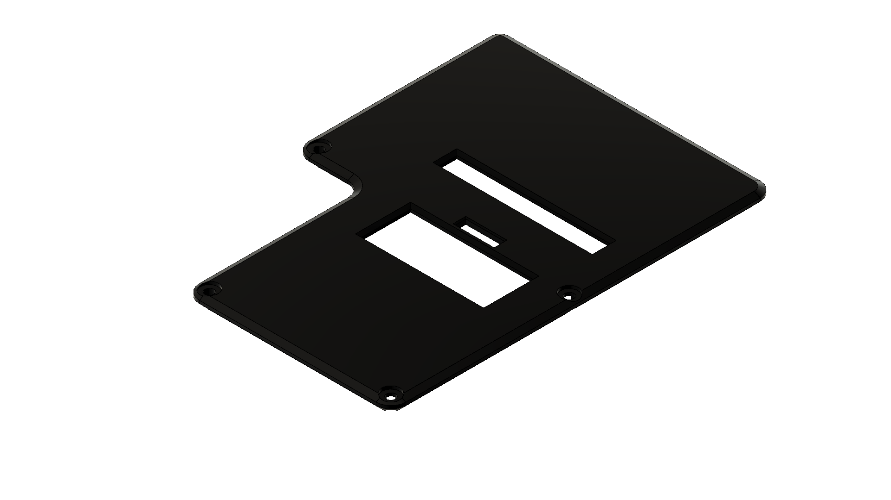

# 3D Models for the Raspberry Pi case

_If you don't know what this is, have a look at the [main README](../../README.md)_

Step files to 3D print a custom case for the Raspberry Pi (incl. space for the hat).

  
  

