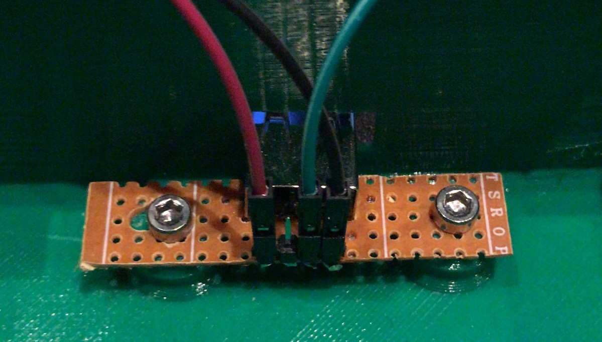

# things-with-buzzers

Things you can do with hardware buzzers in the real world by connecting it with softwrae

## Example code (Python)

```python
import os
import RPi.GPIO as GPIO
import time
import subprocess

PIN_BTN = 12
PIN_LED = 6

GPIO.setmode(GPIO.BCM)
GPIO.setup(PIN_BTN, GPIO.IN, pull_up_down=GPIO.PUD_UP)
GPIO.setup(PIN_LED, GPIO.OUT)
GPIO.output(PIN_LED, GPIO.LOW)

ledOn = False
def buttonDown(channel):
    global ledOn
    print "DOWN!!"
    if (ledOn == True):
        ledOn = False
        GPIO.output(PIN_LED, GPIO.LOW)
    else:
        ledOn = True
        GPIO.output(PIN_LED, GPIO.HIGH)

GPIO.add_event_detect(PIN_BTN, GPIO.RISING, callback=buttonDown, bouncetime=300)

try:
    while True:
        time.sleep(1)
finally:
    GPIO.cleanup()
```

## Wiring

GPIO pin out:

```
USB Port 1:
    Button:    21
    LED:       26

USB Port 2:
    Button:    20
    LED:       19

USB Port 3:
    Button:    16
    LED:       13

USB Port 4:
    Button:    12
    LED:       6
```

Button wiring (from left to right): `RED | xxx | GREEN | BLACK`

* Red = Voltage for the LED
* Green = Button
* Black = Ground (GND)


