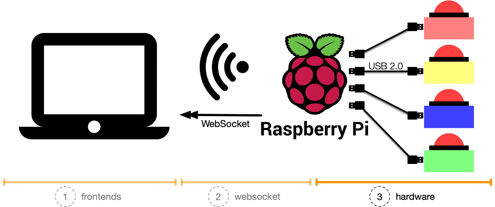
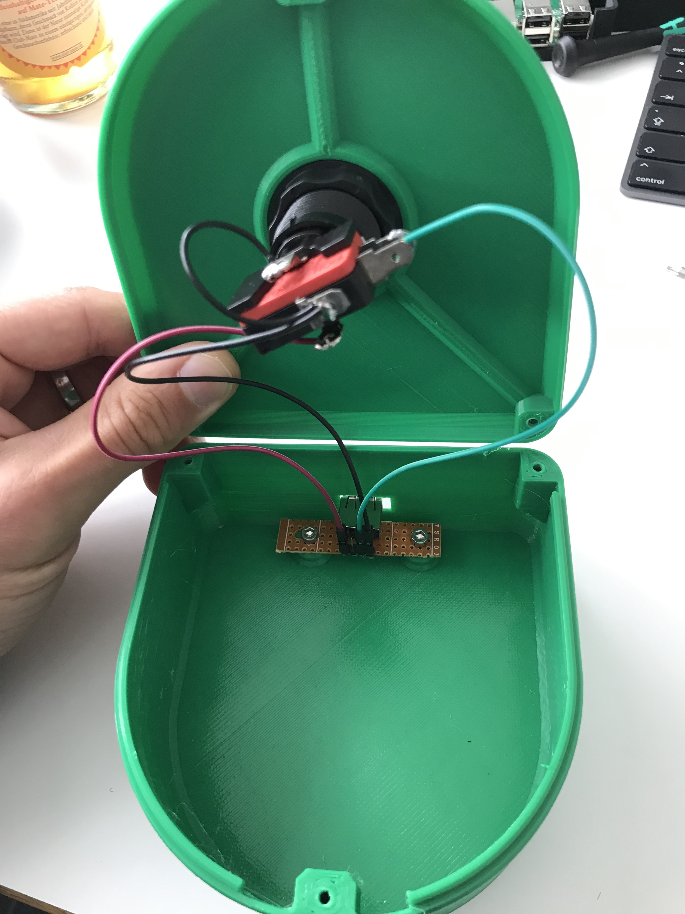
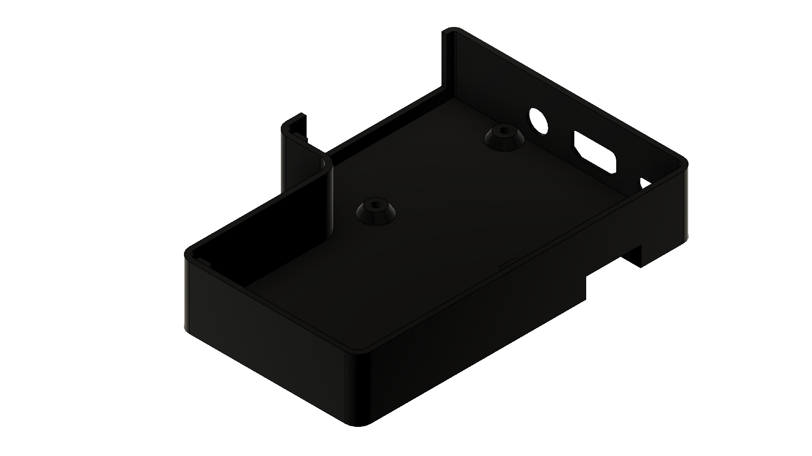
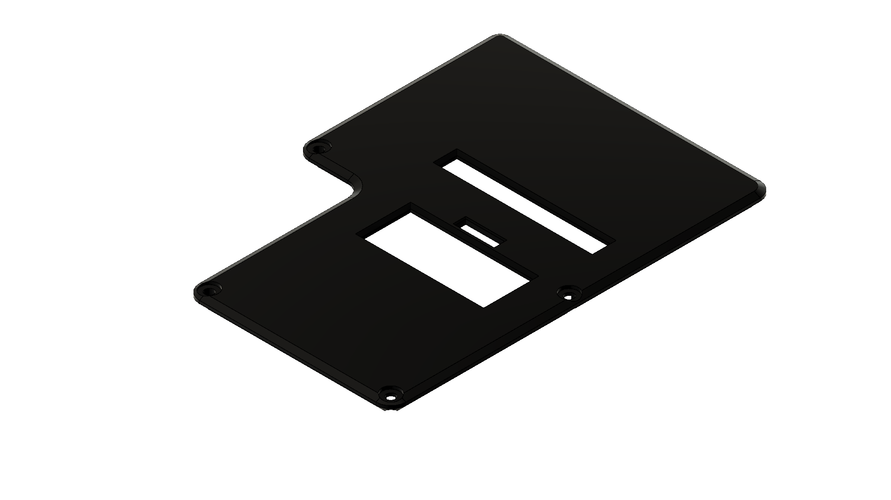

# things with buzzers: hardware

Build your own hardware game show buzzers and do [awesome things](#things-you-can-do-with-buzzers) with it! 🚀

This repository contains everything you need to build hardware buzzers and connecting them with your software.
Start today having fun, and make people happy by providing them an unforgettable time.

  

## Table of Contents

- [How we build and run them](#how-we-build-and-run-them)
- [What we need / Bill of materials (BOM)](#what-we-need--bill-of-materials-bom)
- [Buzzers](#buzzers)
- [Raspberry Pi Hat](#raspberry-pi-hat)
  - [GPIO pin out](#gpio-pin-out)
- [Raspberry Pi](#raspberry-pi)
- [Custom Raspberry Pi case](#custom-raspberry-pi-case)
- [How we can test the buzzers (with software)](#how-we-can-test-the-buzzers-with-software)
- [The result](#the-result)
- [Things you can do with buzzers](#things-you-can-do-with-buzzers)
- [Contribute](#contribute)
- [Acknowledgments](#acknowledgments)

## How we build and run them

We built four game show buzzers in four different colors (red, green, blue, yellow).
The buzzer cases are self-printed with a 3D-Printer.
Each buzzer case has a female USB connector embedded.

The central control unit is a Raspberry Pi 3 Model B+ (following _Pi_) with a custom build hat module (circuit board).
The hat module offers four female USB connectors and maps them onto the GPIO of the Pi.

Each buzzer connects via a USB cable to the Pi hat.
On the Pi, we can place software and read the buzzer signals (e.g., buzzer pressed) and react on this.

If the software (running on the Pi) offers a UI and the Pi connects to a network (or opens up a new network), a client can connect to it.
As a small software example: Show in the UI which button is pressed.

It is how it looks like:

   USB -> Raspberry Pi -> Computer" alt="The complete setup: Buzzer -> USB -> Raspberry Pi -> Computer">

_You are missing context, what this is all about?_
Have a look at

* [(2) things with buzzers: websocket](https://github.com/andygrunwald/things-with-buzzers-websocket).

## What we need / Bill of materials (BOM)

To replicate this project and build your buzzers, you need a couple of things.
We have created a complete list of what you need, a so-called _Bill of material (BOM)_.

Check it out: [Bill of materials (BOM)](./bill-of-materials.md).

## Buzzers

First, we start with the buzzer case and print it with a 3D printer.
Printing instructions / Step files can be found in the [3d-models folder for the buzzer cases](./3d-models/buzzer/).
Feel free to choose the color of your printing material for the right look.
Go ahead and print!

If you are new to 3D printing, step files are printing instructions.
You can few and edit them with software like [Fusion 360 from Autodesk](https://www.autodesk.com/products/fusion-360/free-trial) (they offer [a free version for startups and hobbyists](https://www.autodesk.com/campaigns/fusion-360-for-hobbyists)).

  
  

Next step would be to build the small circuit board that connects the buzzer with the USB socket:

  

Check out the **step-by-step image guide on how to build this** in our [buzzer building folder](./images/buzzer-building/README.md).

Congratulations, you build your first game show buzzer. How awesome is this?

## Raspberry Pi Hat

Second, we build our custom Pi hat.
The buzzers are connected to the GPIO on the Raspberry Pi.
For convenience reasons, we built a custom Pi hat with USB sockets.
This makes it easier to assemble and disassemble the setup.

  
  

We used [EasyEDA](https://easyeda.com/) to design the printed circuit board (PCB).
**We made the project public. Check it out at [RPI 4Button LED HUB from derebbe @ EasyEDA](https://easyeda.com/derebbe/RPI-4Button-LED-HUB)**.

The EasyEDA project shows you which resistor, transistor or pin has to be placed.
Furthermore, you can [order the pre-designed PCB at EasyEDA](https://docs.easyeda.com/en/PCB/Order-PCB).
Pre-designed, in this case, means: You get the circuit board and need to place the components on it.
All wholes are pre-defined, and all components are connected already.

If you want to create the circuit board on your own, you can find all Gerber files in our [Raspberry Pi Hat Gerber folder](./raspberry-pi-hat-gerber/).
You can also do a fresh export from [our project on EasyEDA](https://easyeda.com/derebbe/RPI-4Button-LED-HUB).

If this is done, place the hat on the GPIOs on top of the Raspberry Pi.
By this, you are good to go!

### GPIO pin out

Placing the hat on the pi, you connect the buzzers with the GPIO.
To react with your software on buzzer pushed, you need to know which pins your software need to listen on.
The [GPIO pin out assignment](https://www.raspberrypi.org/documentation/usage/gpio/) looks like the following:

| USB Port  | GPIO Pin | Purpose |
| --------- | -------- | ------- |
| Port #1   | 21       | Button  |
| Port #1   | 26       | LED     |
| Port #2   | 20       | Button  |
| Port #2   | 19       | LED     |
| Port #3   | 16       | Button  |
| Port #3   | 13       | LED     |
| Port #4   | 12       | Button  |
| Port #4   | 6        | LED     |

## Raspberry Pi

Third and last step lets set up the Pi!
On the Raspberry Pi (following _Pi_) itself, we install a [standard Raspbian Lite operating system](https://www.raspberrypi.org/downloads/raspbian/) without any desktop functionality.

To access the Pi from an external client (e.g., laptop or mobile phone) you should connect it to a network.
Either to an existing one via a typical RJ45 LAN cable or a wireless network (can be done via [`raspi-config`](https://www.raspberrypi.org/documentation/configuration/raspi-config.md)).
If you want to run it completely independent and maybe offline, we recommend to [configure the Pi as a wireless access point](https://www.raspberrypi.org/documentation/configuration/wireless/access-point.md).

Add the Pi hat onto the GPIO and move on to your first software tests.

## Custom Raspberry Pi case

A Pi with a hat consumes more space.
Especially with a custom hat, it is hard to find a case that fits.
That's why we printed our own.

Printing instructions / Step files can be found in the 3d-models folder for the raspberry pi case.
Feel free to choose the color of your printing material for the right look.
Go ahead and print!

  
  

## How we can test the buzzers (with software)

Set everything up.
Connect the buzzers with the Raspberry Pi and start the machine.
It is time to test our new hardware with software ❤️.

Have a look at our test scripts and test applications.
Choose the one you like the most (or by roll a dice):

* [test script written in Python 🐍](./software/python/)
* [test application written in Go](./software/go/)

If everything works out, it is okay to freak out and run naked through your flat.
You deserved it. You have built the foundation for more.
Don't stop. Find out [what you can do with buzzers](#things-you-can-do-with-buzzers).

## The result

We have set up a quick demo setup.
Have a quick look at this video: [things with buzzers: hardware showcase @ YouTube](https://youtu.be/pAQNX0Fhxk4).

## Things you can do with buzzers

* Running a Jeopardy! game show
* Stopping athletes time during a sports event

## Contribute

If you are a maker or an engineer or just someone who wants to create and ship awesome things: *Go ahead and make this better*.
Feel free to fork it and play your changes back via a [Pull Request](https://help.github.com/en/articles/about-pull-requests).

If you are unsure or plan to do a more significant rework and you want to get feedback about the idea before you put the effort in: [Open an issue](https://github.com/andygrunwald/things-with-buzzers-hardware/issues/new) and let us talk about your idea.

You have built your own buzzers and did awesome things with it?
Write an article in your blog, or tell us the story in an issue or make a Pull Request with a Markdown file.
But tell us. Let us know. Inspire us!

We believe that we can do more together. Let's to it together! 🚀

## Acknowledgments

A big thank you to [Lars Heß / @lhess](https://github.com/lhess) and [Matthias Endler / @mre](https://github.com/mre).
Without them, this project would not happen.

Lars has designed and built the complete hardware.
Matthias helped a lot with the software and motivation part 😀
