# Buzzer building

If you don't know what this is, have a look at the [main README](../../README.md).
Otherwise, the images will show you how to build the circuit board, which will connect the buzzer with a USB socket.

The following three images are showing you how it looks like:
It contains four male pin headers.
Each pin is connected to one pin of the USB socket.
One USB cable has four wires. We only use three (1 x for the LED in the button, 1 x for the button itself and one for ground (GND)).

  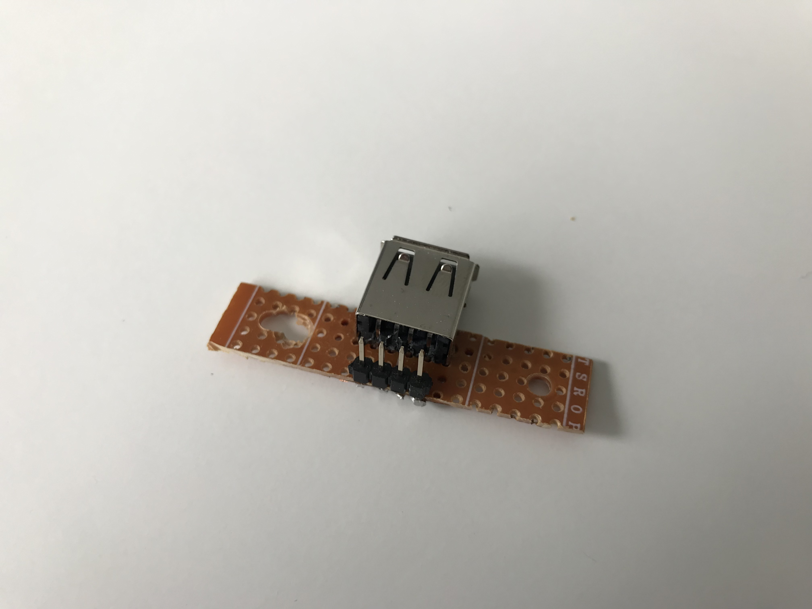

  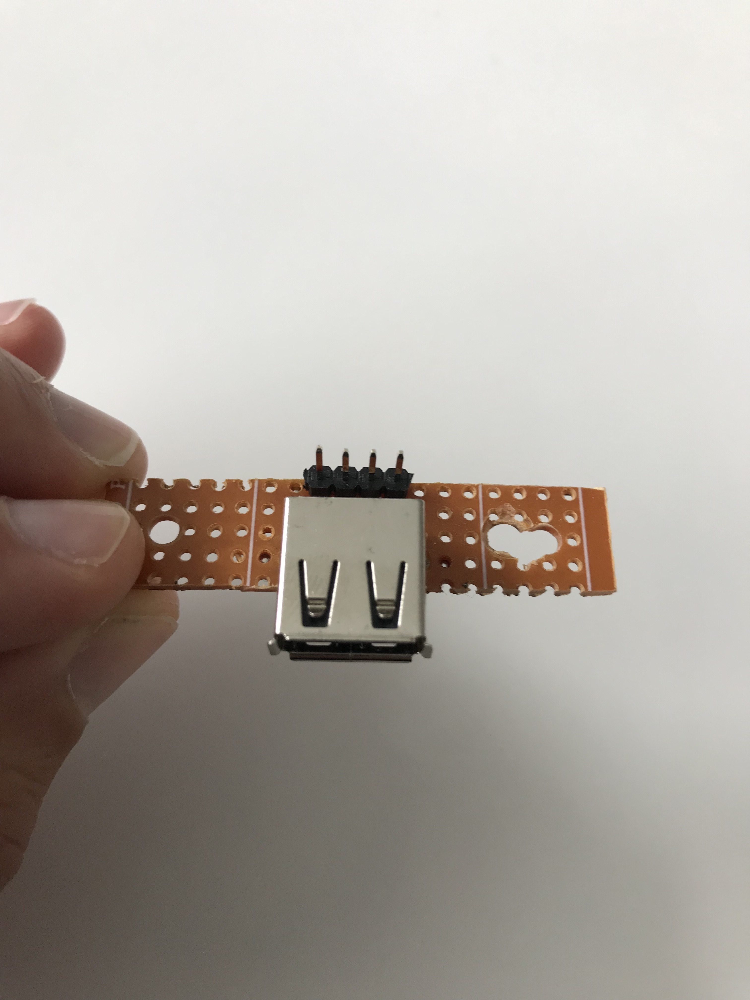

  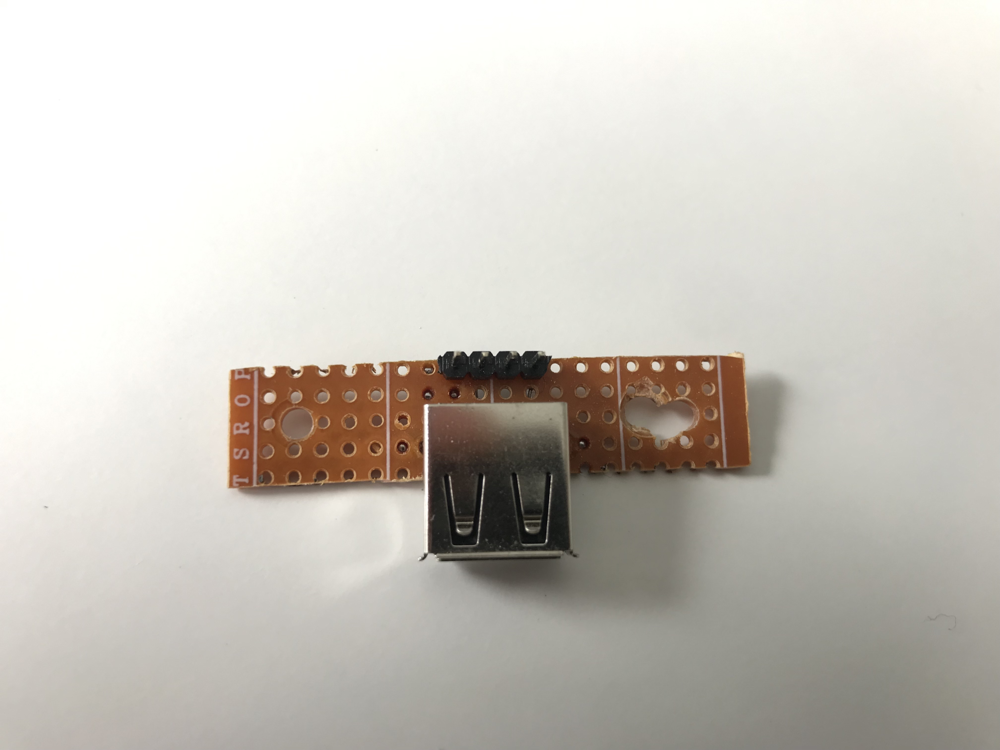

Here you can see how we connect the header pins with the USB socket (by adding tin-solder).

  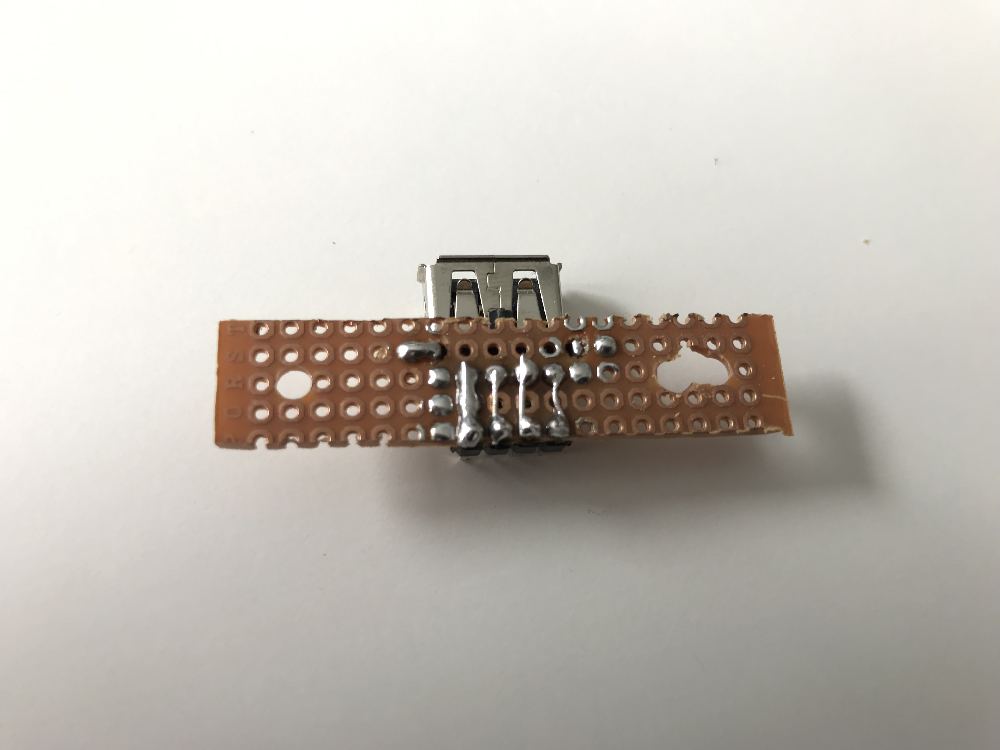

Once the circuit board is done, you fixate it:

  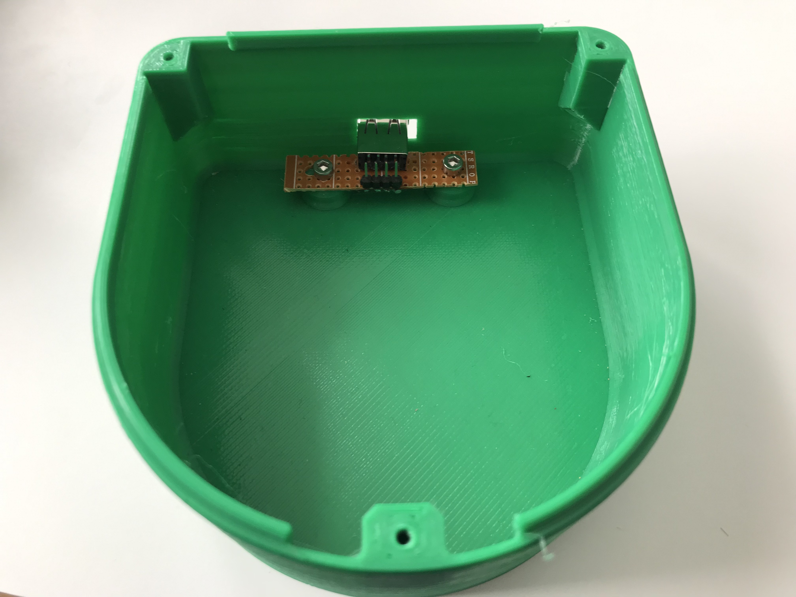

  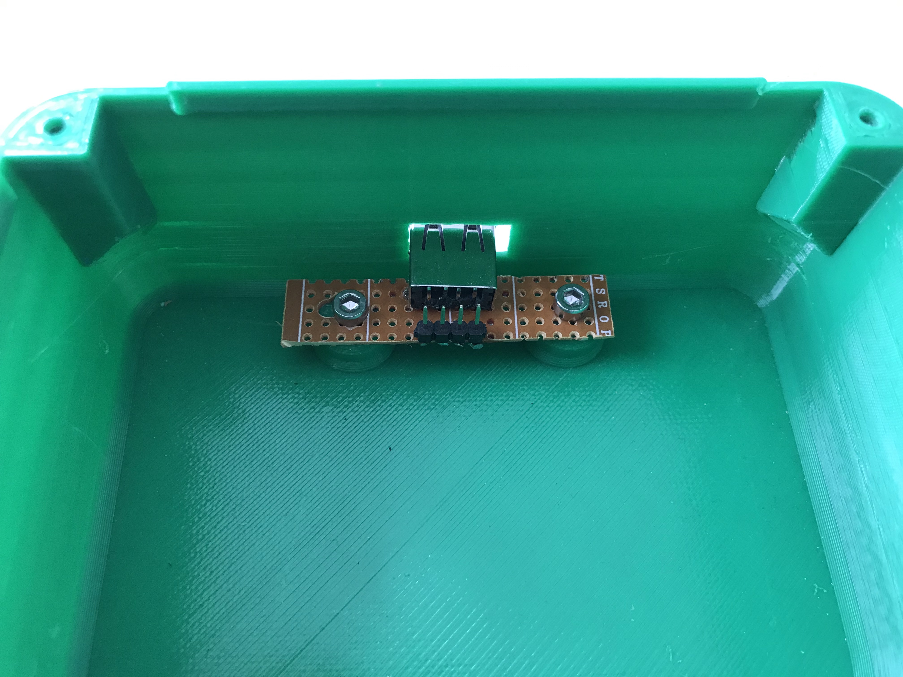

The next step would be to add the buzzer onto our printed lid:

  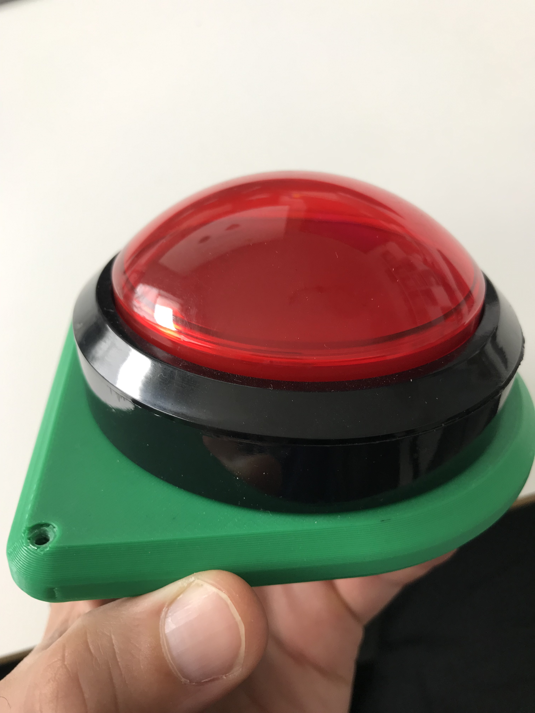

Add the breadboard jumper wires to the buzzer like shown below.
If you plan to build multiple buzzers, we suggest always using the same cable colors for the same purpose.
In our pictures, we used:

* a red 🔴 jumping wire for the LED
* a green 🍏 jumping wire for the Button
* a black ⚫ jumping wire for the ground (GND)

  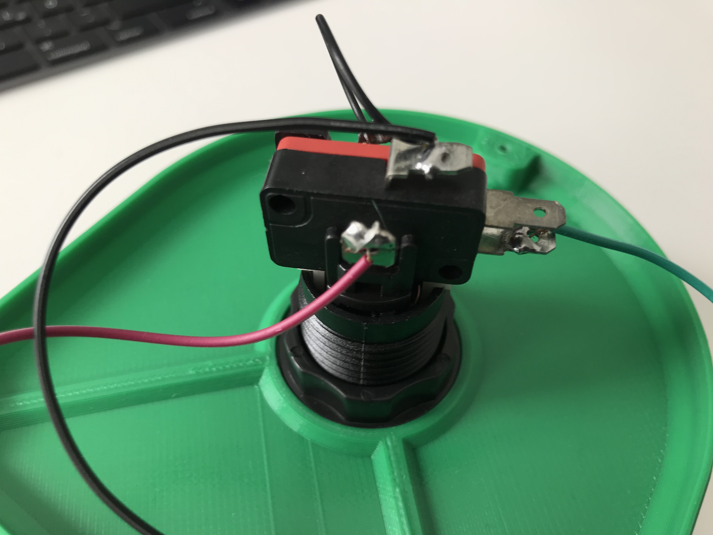

  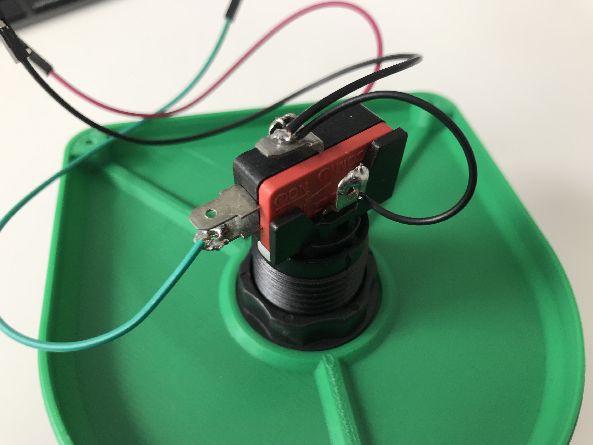

Connect the button with the previously built circuit board.
Please keep the order of the wires in line.
This is important.

  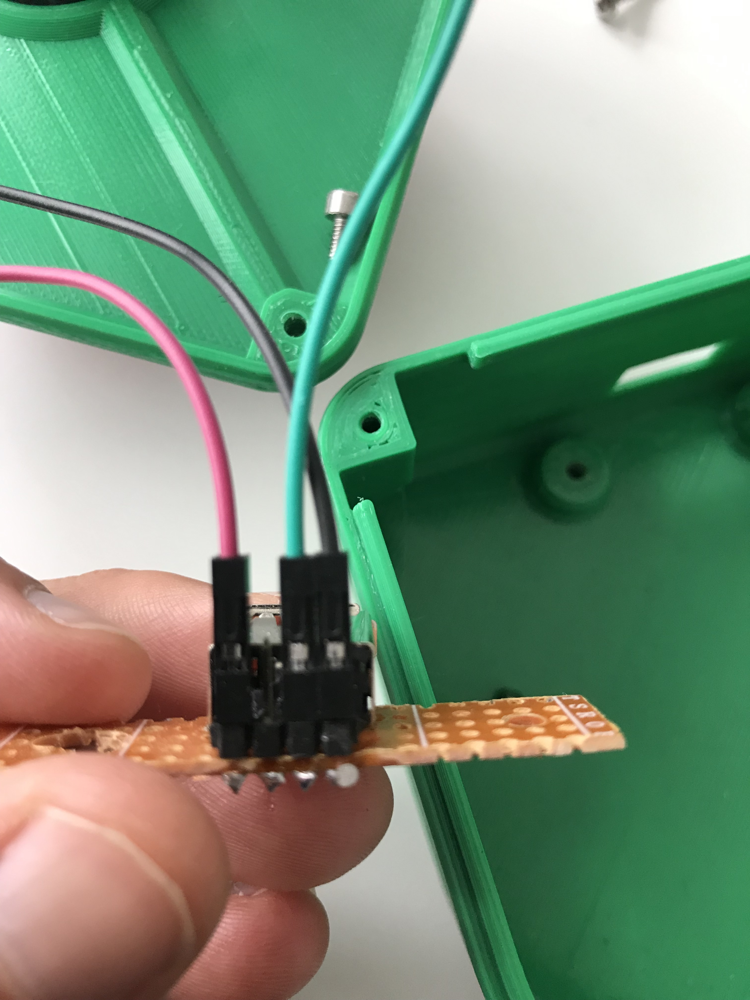 Circuit board wiring (detail)" alt="Buzzer <-> Circuit board wiring (detail)">

  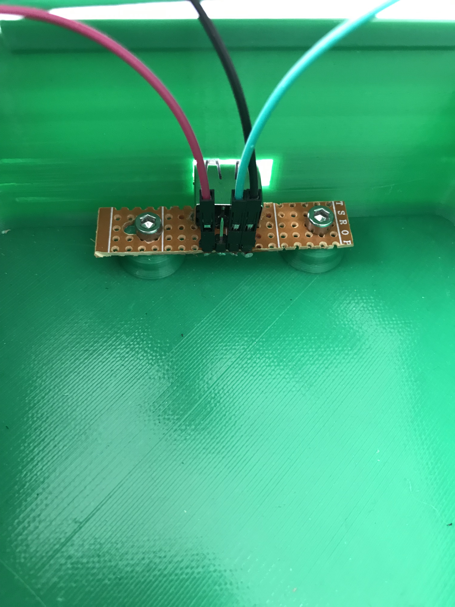 Circuit board wiring (detail / complete)" alt="Buzzer <-> Circuit board wiring (detail / complete)">

This is how the result looks like:

  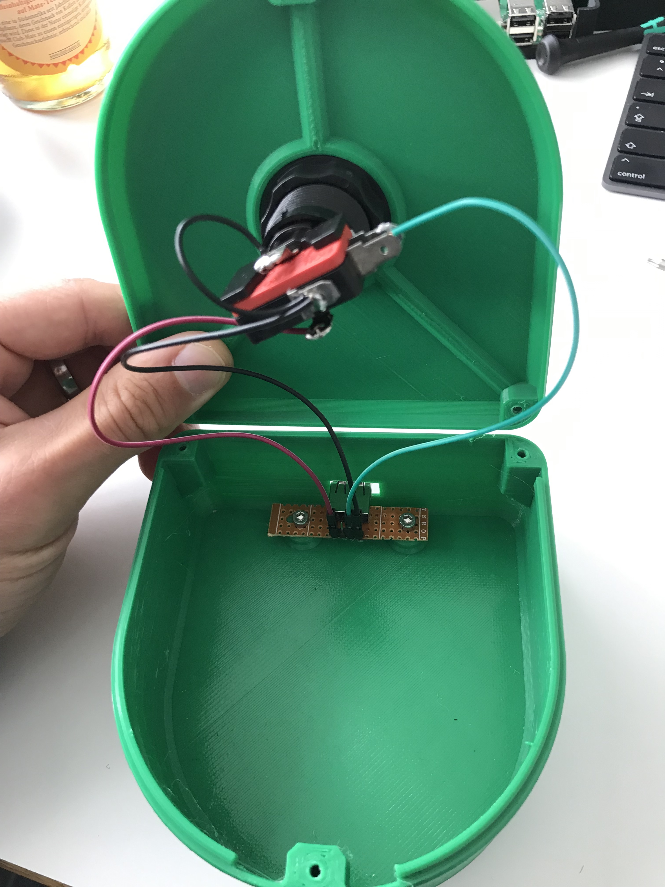

Close the buzzer with three screws and you are done. Congratulations!