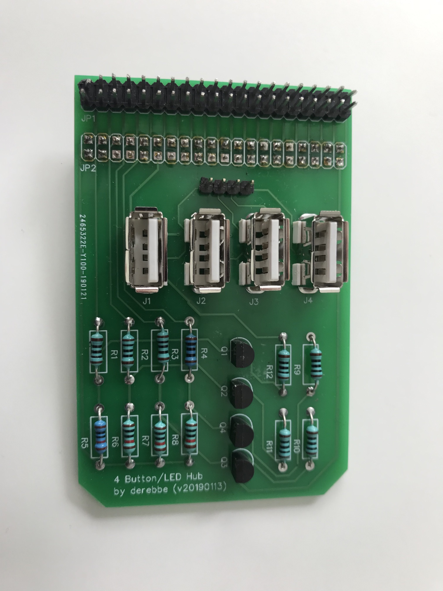

# Raspberry Pi Hat Gerber Files

_If you don't know what this is, have a look at the [main README](../README.md)_

Gerber files to build the Rasberry Pi Hat shown below.
Also available at the [RPI 4Button LED HUB from derebbe @ EasyEDA](https://easyeda.com/derebbe/RPI-4Button-LED-HUB) project.

  

