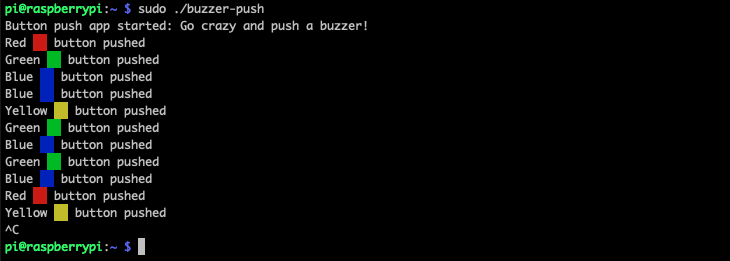

# Go test application

_If you don't know what this is, have a look at the [main README](../../README.md)_

The test application is written in [Go](https://golang.org/).

## Compile it for the Raspberry Pi

```sh
GOARM=7 GOARCH=arm GOOS=linux go build -o "twb-hardware-buzzer-push"
```

## Deployment on your Raspberry Pi

If you are on a Mac or Linux machine, you can deploy this script by using `scp` onto your Raspberry Pi:

```sh
scp -r twb-hardware-buzzer-push pi@192.168.4.1:twb-hardware-buzzer-push
```

In our example, the target Pi has the IP address `192.168.4.1`.

## Start the application

Login into the Pi, switch to the correct folder, and execute:

```sh
sudo ./twb-hardware-buzzer-push
```

## The result

If everything works fine, the result should look like ...

<p align="center">
  
</p>
