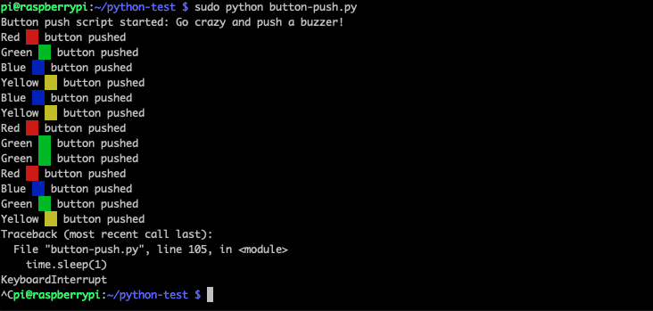

# Python test script

_If you don't know what this is, have a look at the [main README](../../README.md)_

## Deployment on your Raspberry Pi

If you are on a Mac or Linux machine, you can deploy this script by using `scp` onto your Raspberry Pi:

```sh
scp -r * pi@192.168.4.1:python-test/
```

In our example, the target Pi has the IP address `192.168.4.1`.

## Start the script

Login into the Pi, switch to the correct folder, and execute:

```sh
sudo python button-push.py
```

## The result

If everything works fine, the result should look like ...

<p align="center">
  
</p>
